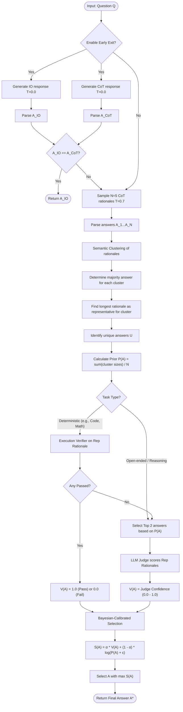

# FrugalReason v3 (PAV) - Algorithm and Flowchart

This document outlines the formal algorithm and provides a flowchart for **FrugalReason v3 (Prior-Adjusted Verification)**. It is designed to be included in a research paper.

## 1. Formal Algorithm

**Algorithm 1: FrugalReason v3 (Prior-Adjusted Verification)**

**Inputs:**
- $Q$: The question or task prompt
- $N$: Number of Chain-of-Thought (CoT) samples to generate (Default: 5)
- $\alpha$: Weighting parameter for verification vs. prior (Default: 0.6)
- $\mathcal{M}$: Large Language Model

**Output:**
- $A^*$: The selected final answer

**Procedure:**

1. **[Optional Early Exit / Gating]**
   - Generate IO response: $R_{IO} \leftarrow \mathcal{M}(Q, \text{prompt}=\text{"IO"}, \text{temp}=0.0)$
   - Generate CoT response: $R_{CoT} \leftarrow \mathcal{M}(Q, \text{prompt}=\text{"CoT"}, \text{temp}=0.0)$
   - Parse answers $A_{IO}$ from $R_{IO}$ and $A_{CoT}$ from $R_{CoT}$
   - **if** parsing is successful and $A_{IO} == A_{CoT}$:
     - **return** $A_{IO}$  *(Early exit on high-confidence consensus)*

2. **[Sampling]**
   - Sample $N$ rationales with CoT prompting at higher temperature ($T=0.7$):
     - $\{R_1, R_2, ..., R_N\} \leftarrow \mathcal{M}(Q, \text{prompt}=\text{"CoT"}, \text{temp}=0.7)$
   - Parse answers $\{A_1, A_2, ..., A_N\}$ from the rationales.

3. **[Semantic Clustering]**
   - Cluster the generated rationales $\{R_1, R_2, ..., R_N\}$ into distinct semantic clusters $C_1, C_2, ..., C_k$ using a similarity threshold (e.g., 0.5).
   - For each cluster $C_j$:
     - Determine the majority answer $A_{C_j}$ (most frequent answer within $C_j$).
     - Identify the representative rationale $R_{C_j}$ (the longest rationale within $C_j$).

4. **[Prior Probability Calculation]**
   - Identify the set of all unique answers $\mathcal{U} = \{A \mid A \in \{A_{C_1}, ..., A_{C_k}\}\}$.
   - For each unique answer $A \in \mathcal{U}$:
     - Calculate the prior probability: 
       $$P(A) = \frac{1}{N} \sum_{j \mid A_{C_j} == A} |C_j|$$
     - Identify the largest cluster representing $A$ and denote its representative rationale as $R_{rep}(A)$.

5. **[Verifier Routing & Scoring]**
   - Initialize verification scores $V(A) = 0.0$ for all $A \in \mathcal{U}$.
   - **if** Task is deterministic (e.g., Game of 24, GSM8K):
     - Route to domain-specific **Execution Verifier**.
     - For each $A \in \mathcal{U}$:
       - $V(A) = \text{Execute}(R_{rep}(A), A)$  *(Returns 1.0 for pass, 0.0 for fail)*
   - **else** (or if execution verifier fails for all):
     - Route to **LLM Judge**.
     - Sort $\mathcal{U}$ descending by prior probability $P(A)$.
     - Select the top 2 answers: $\mathcal{U}_{top2} \subset \mathcal{U}$.
     - For each $A \in \mathcal{U}_{top2}$:
       - $V(A) \leftarrow \text{LLMJudge}(\mathcal{M}, Q, R_{rep}(A))$ *(Returns a confidence score $\in [0, 1]$)*

6. **[Bayesian-Calibrated Selection]**
   - For each $A \in \mathcal{U}$, calculate the final score $S(A)$:
     $$S(A) = \alpha \cdot V(A) + (1 - \alpha) \cdot \log(P(A) + \epsilon)$$
     *(where $\epsilon = 10^{-6}$ for numerical stability)*
   - $A^* = \arg\max_{A \in \mathcal{U}} S(A)$
   - *(Tie-breaking: If multiple answers have the same $S(A)$, select the one with the highest prior $P(A)$)*

7. **return** $A^*$

---

## 2. Flowchart

## 3. Novelty vs. Existing Paradigms

**FrugalReason v3 (Prior-Adjusted Verification)** introduces a novel paradigm by unifying **probabilistic generation, semantic clustering, and adaptive verification** into a single cost-aware pipeline. Here is how it fundamentally differs from existing approaches:

1. **vs. Standard Chain of Thought (CoT) / Greedy Decoding:**
   - **Limitation of CoT:** Standard CoT relies on a single generation path (temperature 0), making it highly susceptible to local minima or early reasoning errors that cascade.
   - **PAV's Novelty:** PAV uses greedy CoT (and Input-Output) as an *early exit gate*. If the deterministic, low-cost outputs match, the algorithm halts and avoids the cost of sampling altogether. If they diverge, it smoothly transitions to a sampling-based approach.

2. **vs. Self-Consistency (SC-CoT):**
   - **Limitation of SC:** Self-consistency strictly relies on the majority vote from $N$ samples. It treats all sampled answers as having equal epistemic weight and completely ignores the *quality* or *logical correctness* of the rationales themselves. A systematically flawed but frequently hallucinated answer will blindly win in standard SC.
   - **PAV's Novelty:** PAV uses the distribution of sampled answers merely to establish a **Prior Probability** ($P(A)$). It does not blindly follow the majority; instead, it extracts a representative rationale for each unique answer cluster and actively verifies them using either deterministic execution or an LLM Judge. The final decision is a **Bayesian-calibrated score** that optimally balances the prior confidence (SC's voting mass) with the posterior verification signal.

3. **vs. Tree of Thoughts (ToT) / Best-of-N (BoN):**
   - **Limitation of ToT & BoN:** ToT requires continuous, bidirectional LLM evaluation at every reasoning step, causing extreme latency and token-cost explosions (often 10x-50x more expensive than CoT). Similarly, standard BoN evaluates every single generated trajectory, scaling verification cost linearly with $N$.
   - **PAV's Novelty:** PAV performs **post-hoc trajectory verification** bounded by clustering. By generating full reasoning trajectories in parallel and evaluating *only* the longest representative rationale for the **top candidate clusters**, PAV achieves verification accuracy that rivals ToT/BoN. Crucially, the verification cost is bounded to a constant $O(1)$ (e.g., max 2 judge calls), making it exponentially cheaper and faster while retaining high reasoning performance.
