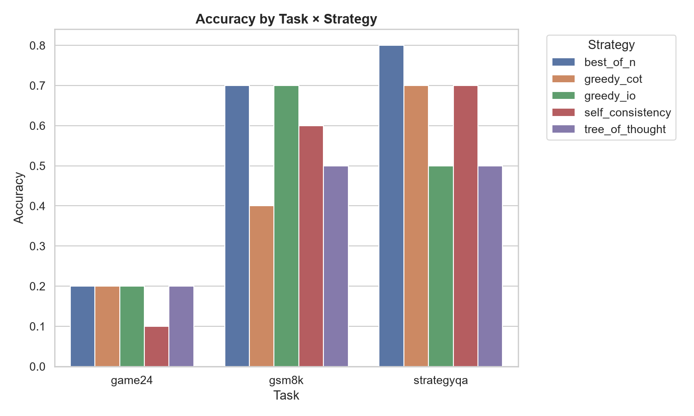
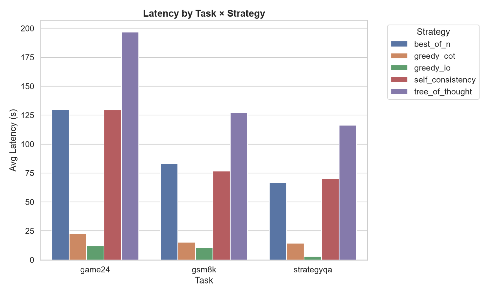
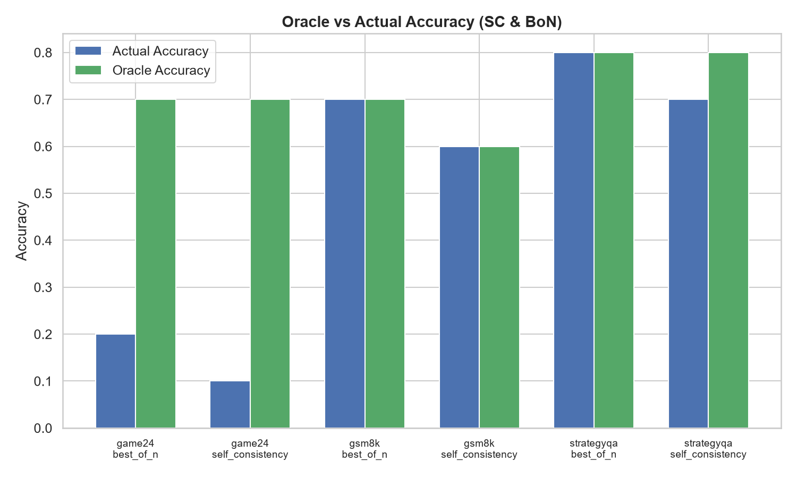
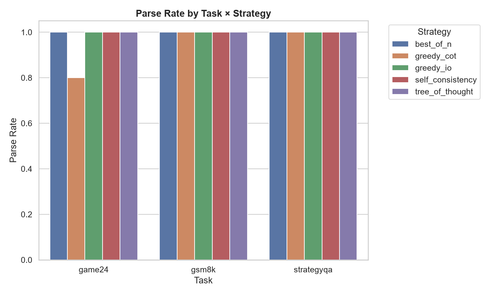
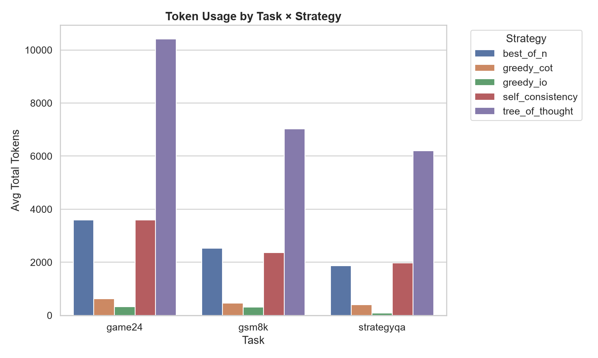

# TTC-Task POC — Experiment Report

**Generated**: 2026-08-10T05:08:13.341612+00:00

## 1. Research Question

> Across different reasoning task types, do different test-time compute (TTC) strategies produce different accuracy, cost, and energy behaviours when constrained to local, small-scale models?

**Model**: `qwen2.5:3b`

## 2. Hardware

- GPU Available: False
- GPU Name: None
- GPU Memory: None MB
- CPU Cores: 12
- RAM: 24445 MB

## 3. Methodology

| Strategy | Paper | Details |
|----------|-------|---------|
| Greedy IO | Baseline | Standard prompt, T=0, 1 call |
| Greedy CoT | Wei et al., 2022 | CoT prompt, T=0, 1 call |
| Self-Consistency | Wang et al., ICLR 2023 | CoT T=0.7, N=5, majority vote |
| Best-of-N | Cobbe et al. / Lightman et al., ICLR 2024 | CoT T=0.7, N=5, ORM scoring |
| Tree-of-Thought | Yao et al., NeurIPS 2023 | Zero-shot BFS, k=3, 8 LLM calls |

## 4. Results

### Accuracy

| task       | strategy         |   num_examples |   accuracy |   parse_rate |   avg_latency_seconds |   avg_total_tokens |   avg_model_calls | avg_energy_joules   |   oracle_accuracy |
|:-----------|:-----------------|---------------:|-----------:|-------------:|----------------------:|-------------------:|------------------:|:--------------------|------------------:|
| game24     | best_of_n        |             10 |        0.2 |          1   |             129.787   |             3591.7 |                 6 |                     |               0.7 |
| game24     | greedy_cot       |             10 |        0.2 |          0.8 |              22.6942  |              627.4 |                 1 |                     |             nan   |
| game24     | greedy_io        |             10 |        0.2 |          1   |              12.1687  |              328.4 |                 1 |                     |             nan   |
| game24     | self_consistency |             10 |        0.1 |          1   |             129.464   |             3588.1 |                 5 |                     |               0.7 |
| game24     | tree_of_thought  |             10 |        0.2 |          1   |             196.654   |            10409.8 |                 8 |                     |             nan   |
| gsm8k      | best_of_n        |             10 |        0.7 |          1   |              83.1063  |             2527.8 |                 5 |                     |               0.7 |
| gsm8k      | greedy_cot       |             10 |        0.4 |          1   |              15.3459  |              461.8 |                 1 |                     |             nan   |
| gsm8k      | greedy_io        |             10 |        0.7 |          1   |              10.5847  |              313.1 |                 1 |                     |             nan   |
| gsm8k      | self_consistency |             10 |        0.6 |          1   |              76.775   |             2369.1 |                 5 |                     |               0.6 |
| gsm8k      | tree_of_thought  |             10 |        0.5 |          1   |             127.236   |             7024.2 |                 8 |                     |             nan   |
| strategyqa | best_of_n        |             10 |        0.8 |          1   |              66.7317  |             1867.6 |                 6 |                     |               0.8 |
| strategyqa | greedy_cot       |             10 |        0.7 |          1   |              14.3477  |              394.2 |                 1 |                     |             nan   |
| strategyqa | greedy_io        |             10 |        0.5 |          1   |               3.11561 |               80   |                 1 |                     |             nan   |
| strategyqa | self_consistency |             10 |        0.7 |          1   |              70.1514  |             1978   |                 5 |                     |               0.8 |
| strategyqa | tree_of_thought  |             10 |        0.5 |          1   |             116.149   |             6201.3 |                 8 |                     |             nan   |

## 5. Plots

### Accuracy By Task Strategy

### Latency By Task Strategy

### Oracle Vs Actual Accuracy

### Parse Rate By Task Strategy

### Tokens By Task Strategy

## 6. Limitations

- This is a **small-scale POC** (10 questions/task) with a 3B parameter model. Results are NOT directly comparable to GPT-4/PaLM-based paper results.
- Local 3B models may struggle with complex ToT/BoN formatting requirements.
- ORM scoring uses an outcome-match proxy, not a trained Process Reward Model.
- Energy measurement accuracy depends on GPU driver support.
- Game of 24 is diagnostic only — small models rarely solve it.

